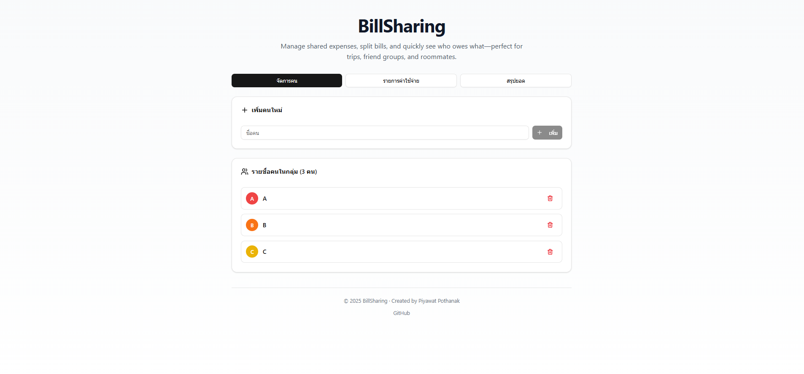

<div align="center">

# 💸 BillSharing

**แอปแบ่งบิล/แชร์ค่าใช้จ่าย — ง่าย รวดเร็ว ไม่ต้องมีเซิร์ฟเวอร์**

[](https://nextjs.org/)
[](https://react.dev/)
[](https://tailwindcss.com/)
[](https://www.typescriptlang.org/)

<br />



</div>

---

## ✨ ฟีเจอร์หลัก

|            🧑‍🤝‍🧑 จัดการคน            |             📝 บันทึกรายจ่าย              |        📊 สรุปยอด         |
| :-------------------------------: | :---------------------------------------: | :-----------------------: |
| เพิ่ม/ลบคนในกลุ่ม พร้อมสีประจำตัว | ตั้งชื่อ จำนวนเงิน เลือกผู้จ่ายและผู้แชร์ | ดูยอดสุทธิ ใครได้/ใครเสีย |

- ✅ **คำแนะนำการชำระ** — แสดงว่าใครควรโอนให้ใคร เท่าไร
- ✅ **บันทึกอัตโนมัติ** — เก็บข้อมูลใน `localStorage` (ไม่ต้องมี backend)
- ✅ **Dark Mode** — รองรับธีมมืด/สว่าง
- ✅ **Responsive** — ใช้งานได้ทุกขนาดหน้าจอ

---

## 🚀 เริ่มต้นใช้งาน

```bash
# 1. ติดตั้ง dependencies
npm install

# 2. รันโหมดพัฒนา
npm run dev

# 3. เปิดเบราว์เซอร์
open http://localhost:3000
```

### 📦 คำสั่งอื่นๆ

| คำสั่ง          | รายละเอียด                |
| --------------- | ------------------------- |
| `npm run build` | สร้างไฟล์ production      |
| `npm run start` | รันเซิร์ฟเวอร์ production |
| `npm run lint`  | ตรวจสอบโค้ด               |

---

## 🛠️ เทคโนโลยี

<table>
<tr>
<td align="center"><br/><b>Next.js 16</b></td>
<td align="center"><br/><b>React 19</b></td>
<td align="center"><br/><b>Tailwind 4</b></td>
<td align="center"><br/><b>TypeScript</b></td>
</tr>
</table>

**อื่นๆ:** Radix UI • Lucide Icons • localStorage

---

## 📁 โครงสร้างโปรเจกต์

```
src/
├── app/                      # Next.js App Router
│   ├── layout.tsx            # Layout หลัก
│   ├── page.tsx              # หน้าแรก (Tab-based)
│   └── globals.css           # Global styles
├── components/
│   ├── person-management/    # จัดการคนในกลุ่ม
│   ├── expense-tracking/     # บันทึกค่าใช้จ่าย
│   ├── summary-dashboard/    # สรุปยอด
│   ├── navigation.tsx        # แท็บนำทาง
│   ├── footer.tsx            # Footer
│   └── ui/                   # UI components (shadcn)
├── hooks/
│   ├── use-expense-data.ts   # State + คำนวณยอด
│   └── use-local-storage.ts  # localStorage hook
├── types/
│   └── index.ts              # TypeScript interfaces
└── lib/
    ├── utils.ts              # Utilities
    └── constants.ts          # Constants
```

---

## 📖 วิธีใช้งาน

<table>
<tr>
<td width="33%">

### 1️⃣ เพิ่มคน

ไปที่แท็บ **จัดการคน** แล้วเพิ่มรายชื่อสมาชิก

</td>
<td width="33%">

### 2️⃣ บันทึกรายจ่าย

ไปที่ **รายการค่าใช้จ่าย** กรอกข้อมูล เลือกผู้จ่าย/ผู้แชร์

</td>
<td width="33%">

### 3️⃣ ดูสรุป

ไปที่ **สรุปยอด** ดูว่าใครต้องจ่ายให้ใคร

</td>
</tr>
</table>

---

## 🧮 หลักการคำนวณ

```
ยอดสุทธิ = ยอดที่จ่ายจริง − ยอดที่ควรจ่าย
```

- ➕ **ค่าบวก** → ควรได้รับเงินคืน
- ➖ **ค่าลบ** → ต้องจ่ายเพิ่ม

---

## 💾 การเก็บข้อมูล

ข้อมูลถูกเก็บใน **localStorage** ของเบราว์เซอร์:

| Key                | ข้อมูล           |
| ------------------ | ---------------- |
| `expense-people`   | รายชื่อคน        |
| `expense-expenses` | รายการค่าใช้จ่าย |

> ⚠️ **หมายเหตุ:** ข้อมูลไม่ซิงก์ระหว่างอุปกรณ์ หากล้าง cache ข้อมูลจะหายไป

---

## 🚢 Deploy

แนะนำ [**Vercel**](https://vercel.com) — ดู [คู่มือ Deploy](https://nextjs.org/docs/app/building-your-application/deploying)

```bash
npm run build && npm run start
```

---

## 📋 Changelog

### v0.2.0 (2025-12-21) — Code Organization

- 📁 แยก components เป็น folder structure
- 📝 เพิ่ม `lib/constants.ts` และ `TabType`
- 🔧 แก้ไข deprecated APIs (`onKeyPress` → `onKeyDown`)
- 🧹 ลบ unused imports

### v0.1.0 (2025-12-21) — Initial Release

- ✨ ฟีเจอร์จัดการคน/บันทึกรายจ่าย/สรุปยอด
- 💾 บันทึกด้วย localStorage
- 🌙 รองรับ Dark Mode

---

<div align="center">

## 👨‍💻 ผู้พัฒนา

**Piyawat Pothanak**

[](https://github.com/TiwKill)

---

<sub>© 2025 BillSharing — Made with ❤️ in Thailand</sub>

</div>
